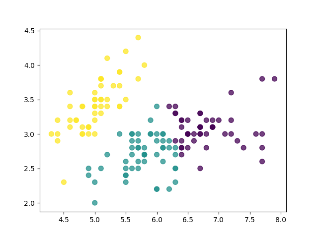

## Gradient Descent:
   - Most basic type of linear regression, using gradient descent to learn.
## Logistic Regression:
   - A simple binary classification algorithm..
   - correctness: over 95%
## SimpleNN:
   - A simple neural network using cross-entropy cost function to do classification on mnist dataset
   - correctness: Around 96% under given parameters
## KMeans:
   - Simply implemented the KMeans algorithm to do a unsupervised learning
   - correctness: 
